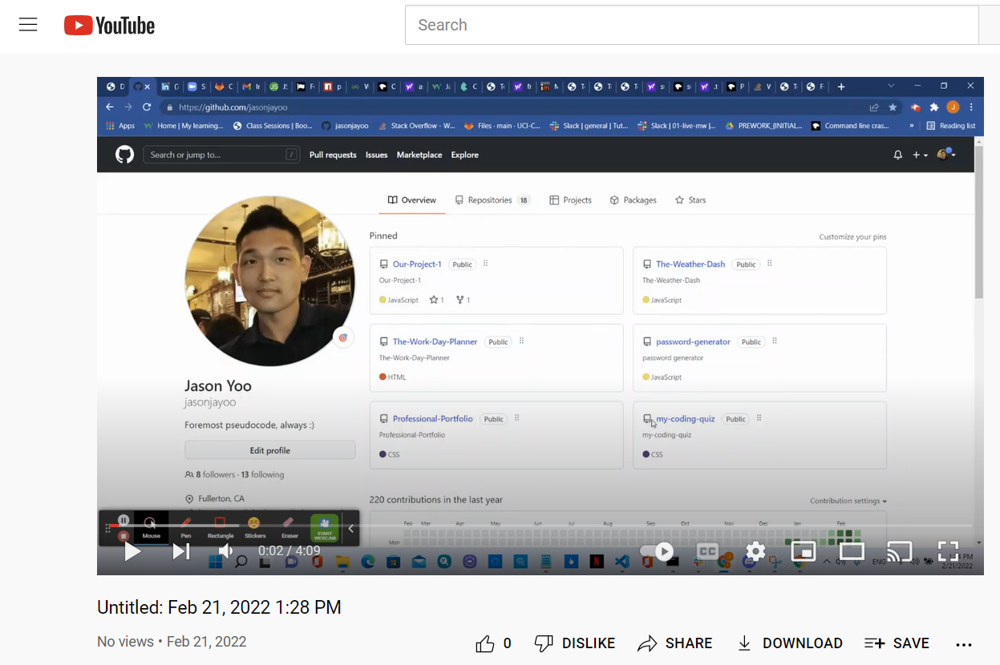
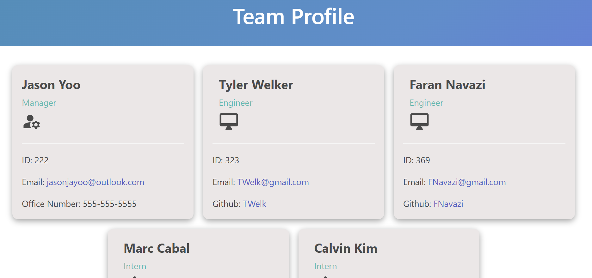
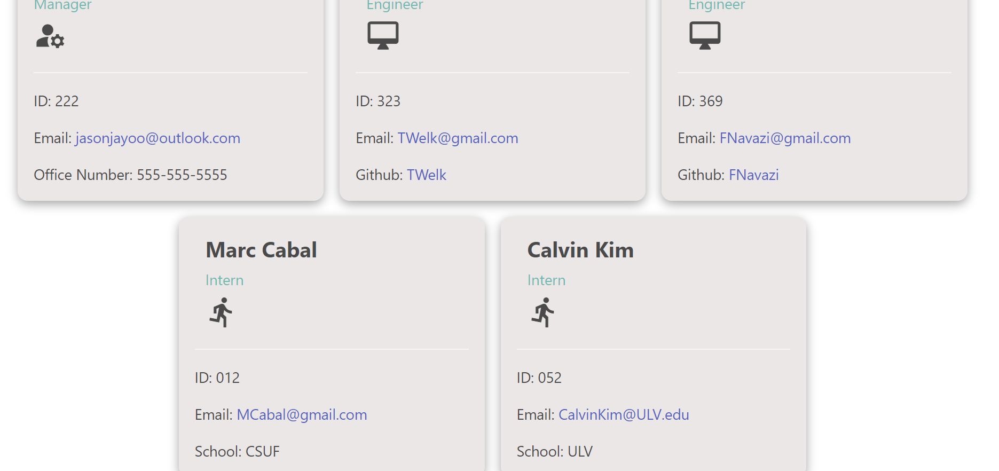
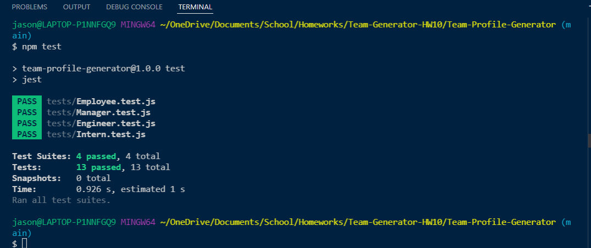
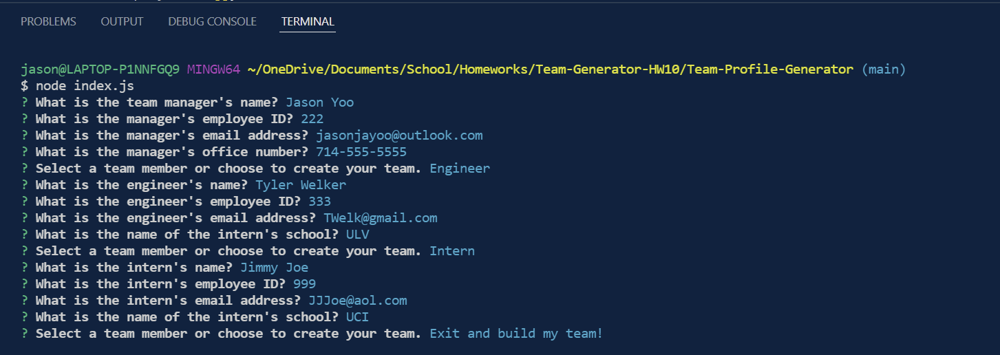
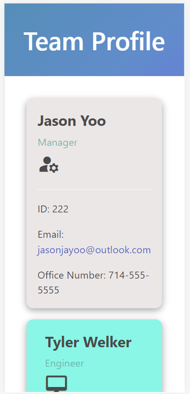

# Team-Profile-Generator

(Homework - 10: Object-Oriented Programming: Team Profile Generator)

 

  
 

## Description:

Create a Node.js command-line application that takes in information about employees on a software engineering team, then generates an HTML webpage that displays summaries for each person. Must include tests for every part of the code and ensure that it passes each test.

 
 

## Table of contents:

  * [License](#license)
  * [Video](#video)
  * [Installation](#installation)
  * [Usage](#usage)
  * [Contributions](#contributions)
  * [Tests](#tests)
  * [Credits](#credits)
  * [Author](#author)
  * [Questions](#questions)

 
 
  
## License:
 
      -  MIT License - Copyright (c) 2022 Jason Yoo

 
 

## Video:

  
  
  
 

## Installation:
 
      -  Clone the files from my github repository provided below

 
 
  
## Usage: screenshots - (Highlighted Title(s) = a hyperlink to the direct image)

 

Once downloaded, open the file in VS Code.

 
  

[Screenshot1](images/Screenshot1.png)  "Web Application Rendered in Browser Showing Manager & Engineers"

[Screenshot2](images/Screenshot2.png)  "Web Application Rendered in Browser Showing All Employees"

 

[Screenshot3](images/Screenshot3.png)  "Screenshot of npm test passing all four tests"

 

[Screenshot4](images/Screenshot4.png)  "Screenshot of all prompted questions answered before submission"

 

[Screenshot5](images/Screenshot5.png)  "Screenshot of application in mobile screen size (iphone12)"

 
 

  
## Contributions:
 
Reach me at my email provided below to be added as a contributor.

 
 
  
## Tests: 
 
npm install inquirer and jest along with .fs. Once they're installed, run a test by typing npm test/npm run test into the terminal.
  
 
 

## Credits:
 
Much thanks to my brilliant tutor Mr. Faran Navazi for helping me start on a solid foundation for the development of this application.
 
I would also like to thank my fellow cohort member Mr. Lewis Marcus for all his help!

 
 

## Author:
 
Jason Yoo
  
 
 

## Questions:
  For any questions regarding this application, you may reach me directly at jasonjayoo@outlook.com.

  To view my other applications, please check out my github page [jasonjayoo](https://github.com/jasonjayoo).
